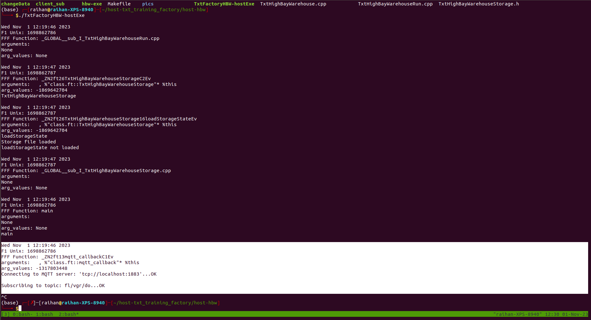
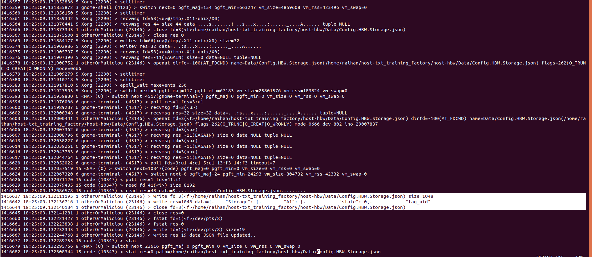
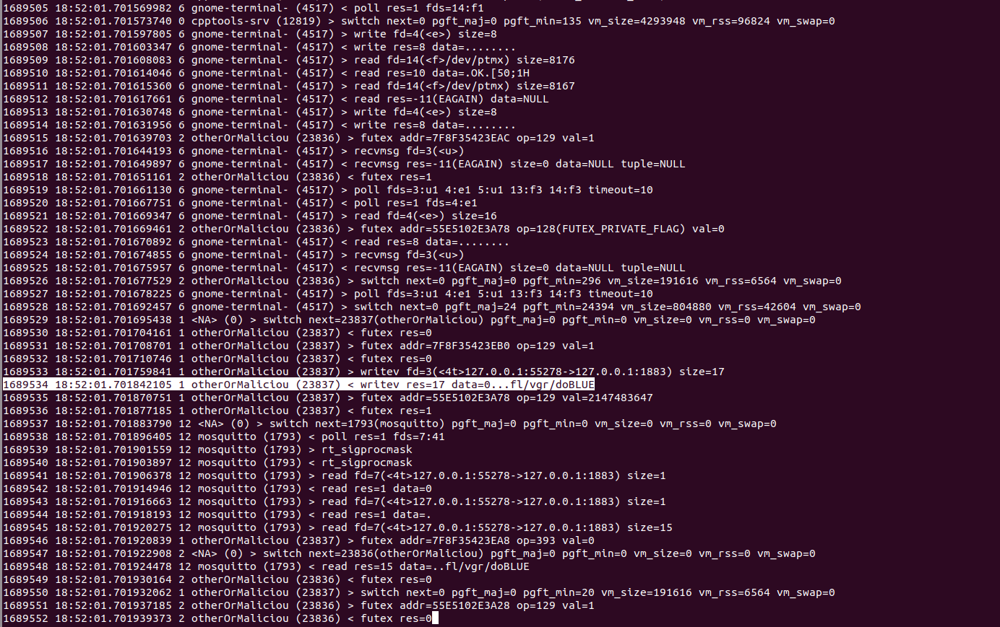
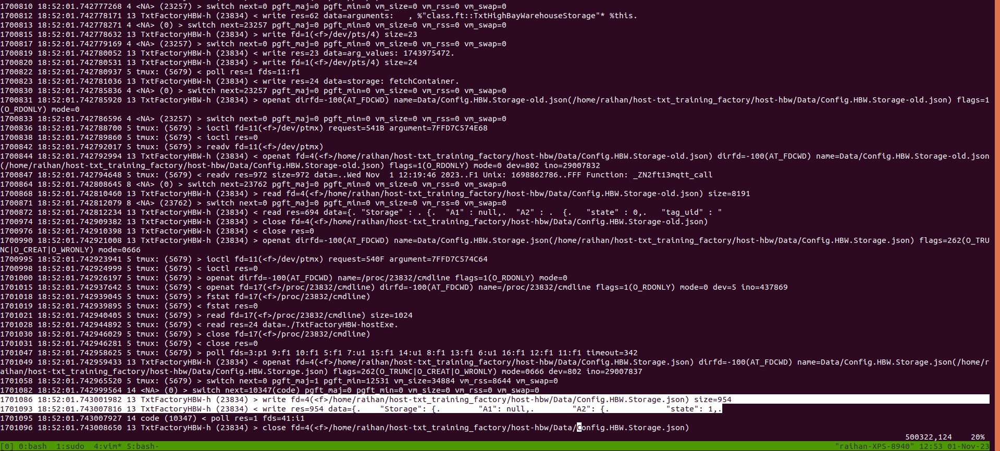
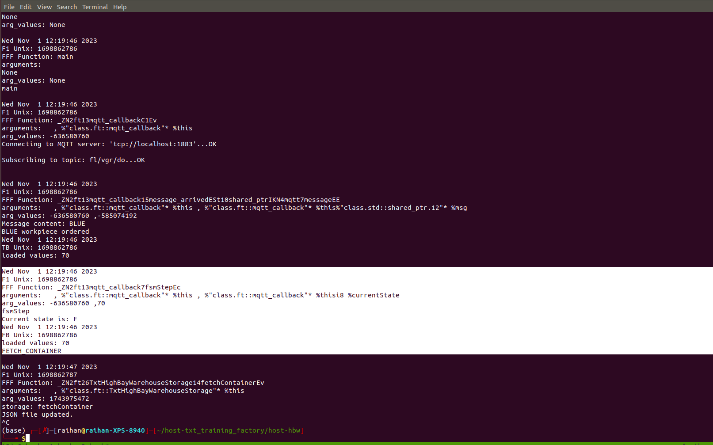
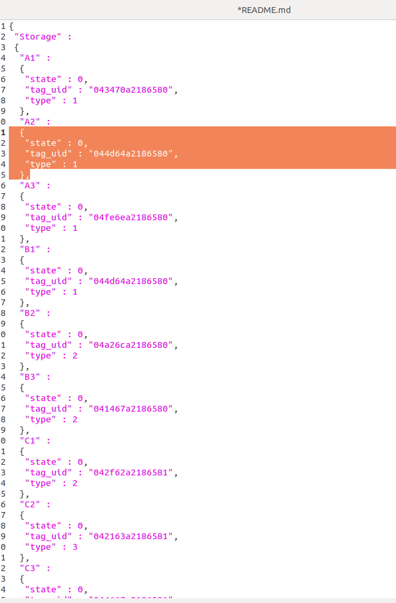
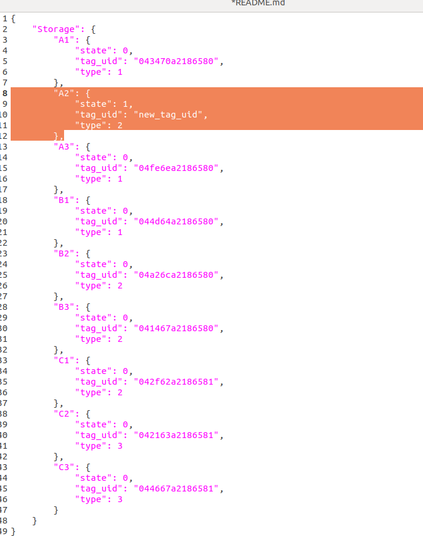

## Executing order
1. Run the `TxtHighBayWarehouseRun.cpp` file
    - Get the headers needed
    - check if needed to use the mqtt

2. Then follow order whichever needed


### Cmd's:
```
g++ TxtHighBayWarehouseRun.cpp TxtHighBayWarehouseStorage.cpp
./a.out
```

### with clang
```
clang++-14 -fno-discard-value-names -flegacy-pass-manager -g -Xclang -load -Xclang /home/raihan/LogPasses-new/FAVCIGVT\*/instrument.so TxtHighBayWarehouseRun.cpp TxtHighBayWarehouseStorage.cpp
```

## Json data changed
```
g++ changeData.cpp -I ~/vcpkg/installed/x64-linux/include/ -o changeData
```

# Attacking phase in host `hbw`

### HBW phase
Created the `TxtFactoryHBW-hostExe` in this dir `~/host-txt_training_factory/host-hbw` with Makefile.


### Changed data with json file - ATTACK-1
`changeData.cpp` file is used to change data.
Created the `otherOrMalicious` file in this dir `~/host-txt_training_factory/host-hbw`
```
g++ changeData.cpp -I ~/vcpkg/installed/x64-linux/include/ -o otherOrMalicious
```
**I executed the hbw file and the `fetch/fetchContainer/move/SaveStorageState` function were not called.**



**But the data has been written by another script**


`sysdig` logs are here: `/home/raihan/sysdig-logs/docker-sysdig/sysdig3`
hbw output is here: `/home/raihan/host-txt_training_factory/host-hbw/hbw-output-otherOrMalicious`

### Changed data with mqtt file - ATTACK-2

Created the `otherOrMaliciousMqtt` file with following command inside this directory `~/Attacking_Phase/mqtt_attack`
```
clang++-14 publisher.cpp -o otherOrMalicious -lpaho-mqttpp3 -lpaho-mqtt3c -lpaho-mqtt3a -lmosquitto
```

Now, executed the `TxtFactoryHBW-hostExe` and also executed `sysdig > sysdig3-mqtt` inside the docker container. Then I executed the `otherOrMaliciousMqtt`. Here is the result,



So, the `otherOrMaliciousMqtt` file published the data. And in the following pic, it shows that the data has been written to the file.



Also, the `fetchContainer` function is called **but the `publish` function is not called as per the following picture,



**The `fetchContainer` is called but there is no `publish` function.**

`sysdig` logs are here: `/home/raihan/sysdig-logs/docker-sysdig/sysdig3-mqtt`
hbw output is here: `/home/raihan/host-txt_training_factory/host-hbw/hbw-output-otherOrMaliciousMqtt`

### Changed data
In both cases, data changed from,



to this,



